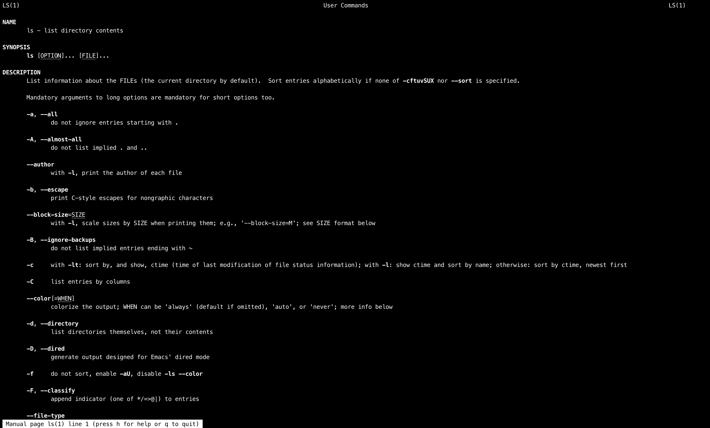

# Основы GNU/Linux

В данном руководстве постараюсь изложить очень простым языком небольшую справочную информацию о Linux. Так как это руководство ориентировано на начинающих, то имеет массу допущений и неполноты. Однако, постараюсь не включать сюда заведомо ложную информацию. А еще тут будет много очепяток, пишу на ходу :)

## 1. Основные определения

[Linux][linux-core] - ядро операционной системы, написано на Си, открытое ПО

[GNU/Linux][linux-os] - семейство операционных систем на основе ядра Linux и программ проекта GNU

[Unix-way][unix-way] - философия UNIX, как и любая философия может быть крайне абстрактной и обширной. Подхвачено в GNU/Linux. Сводится как правило к:
- Пишите программы, которые делают что-то одно и делают это хорошо.
- Пишите программы, которые бы работали вместе.
- Пишите программы, которые бы поддерживали текстовые потоки, поскольку это универсальный интерфейс

[Сисколл/Syscall][syscall] - системный вызов, обращение программы к ядру операционной системы для выполнения какой-либо операции. Например, для открытия и чтения файла. С точки зрения программиста высокого уровня можно сказать что Ядро ОС - это такая хитрая библиотека, методы которой мы дергаем. Вот эти методы и называются системными вызовами.

[Каталог][dir-term] - оно же директория, оно же папка, дальше буду называть как получится.

[Файл][file] - в терминах Linux - всё. Буквально. Любой организованный массив байт на диске, сам диск, сетевое соединение, каталоги. И это универсальный способ взаимодействия с чем угодно, без необходимости понимать как оно работает. Файловая подсистема в Linux это произведение искусства, про которое стоит упомянуть в отдельном разделе "как это устроено".

[Дескриптор][descriptor] - нечто, что однозначно идентифицирует объект. В терминах Linux, как правило, дескриптор - числовой идентификатор, номер.

[Файловый дескриптор][fd] - он же fd, целое неотрицательное число. Когда создается новый поток ввода-вывода (например, при открытии файла), ядро возвращает процессу, создавшему поток ввода-вывода, его файловый дескриптор.

[Стандартные потоки][streams] - потоки процесса, имеющие номер (дескриптор), зарезервированный для выполнения некоторых «стандартных» функций
- 0 - stdin - зарезервирован для чтения команд пользователя или входных данных (как правило - текстовых)
- 1 - stdout - зарезервирован для вывода данных (как правило - текстовых)
- 2 - stderr - зарезервирован для вывода диагностических и отладочных сообщений в текстовом виде

Обозначения комбинаций CTRL+Что-то - CTRL+C - `^C`, CTRL+Z - `^Z`, ну вы поняли. Общепринятое.

[Ключ][options] - опции утилит командной строки, подробнее в пункте 3.1.

## 2. Основные команды

В данном разделе буду описывать основные команды с которыми придется работать любому пользователю Linux.

### 2.1 man

[Man](https://ru.wikipedia.org/wiki/Man), от manual - программа для чтения документации (мануалов/манов). Вот так просто. Получает на вход название страницы мануала, как правило совпадает с названием команды, для которой хочешь вызвать справку. Все страницы имеют схожую структуру, разобраться очень просто. Запускает встроенное средство для просмотра страницы, чтобы перемещаться - нажимать вверх/вниз, можно осуществлять поиск набрав `/`, далее что ищем, потом `enter`. Нажать `q` для выхода.

Пример вызова 1:
```bash
man
```
Пример вывода 1:
```
What manual page do you want?
```

Пример вызова 2:
```bash
man ls
```
Пример вывода 2:



## 3. Как это устроено? Упрощенно.

### 3.1 Ключи или опции

Ключи, они же опции, они же опциональные аргументы. Например при вызове `ls -la` - la это ключи.  
Причем два сразу. Ключи бывают 2 видов:

**Тип 1.** Однобуквенные, их можно передавать после одного минуса (некоторым старым утилитам типа ps вообще без ничего), как правило можно еще и склеивать, т.е. писать не `ls -l -a`, а сразу `ls -la` или `ls -al`, в данном случае все 3 вызова приведут к одинаковому результату.

Иногда после ключа может следовать какой-нибудь переменный аргумент, например `tail -n 2 filename` или `tail -n2 filename` позволит вывести только 2 последних строки filename. Такие можно комбинировать, но так, чтобы сразу после ключа с аргументом шел его аргумент и далее обязателен пробел.

Примеры как можно, а как нельзя:
| Команда | Так можно? |
| :-- | :--: |
| `tail -vn2 filename` | ДА |
| `tail -vn 2 filename` | ДА |
| `tail -n2v filename` | **НЕТ** |
| `tail -n2 -v filename` | ДА |

**Тип 2.** Многобуквенные/полнословные, они выглядят как-то так `git --version` и как правило являют собой осознанное слово. Комбинировать нельзя, только через пробелы и 2 отдельных минуса, а-ля:
```bash
git commit --comment "Фигня какая-то, да?" --amend --version
```

У некоторых утилит (например `git`) обязательные аргументы должны идти строго после опциональных, т.е. так:
```bash
tail -n2 filename
```
А не так:
```bash
tail filename -n2
```
Но большинству стандартных утилит (в т.ч. и `tail`) на это фиолетово, что удобно, потому как иногда нужно менять только опции несколько раз запуская одну утилиту. Просто стоит держать в голове.

Зачастую у ключей бывает обе формы, тогда в документации они будут указаны рядом. Можно свободно комбинировать и те, и другие. Например:
```bash
git commit -m "Ничего не понятно, но очень интересно" --amend
```


### 3.2 Файловая подсистема
### 3.3 Процесс загрузки


## Ссылки

[linux-core]: https://ru.wikipedia.org/wiki/Ядро_Linux
[linux-os]: https://ru.wikipedia.org/wiki/Linux
[unix-way]: https://ru.wikipedia.org/wiki/Философия_Unix
[streams]: https://ru.wikipedia.org/wiki/Стандартные_потоки
[descriptor]: https://ru.wikipedia.org/wiki/Дескриптор
[fd]: https://ru.wikipedia.org/wiki/Файловый_дескриптор
[file]: http://linux.yaroslavl.ru/docs/setup/mandrake/cl/ch09s02.html
[dir-term]: https://ru.wikipedia.org/wiki/Каталог_(файловая_система)
[syscall]: https://ru.wikipedia.org/wiki/Системный_вызов
[options]: http://www.linuxcookbook.ru/books/textbooks/linux_intro/ch03s04.html
